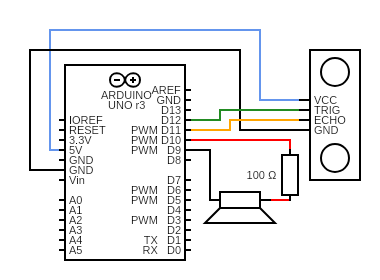
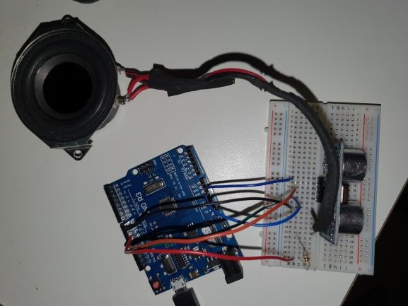

# Theremin

## What it does
This is an arduino UNO version of a theremin.
A theremin is an instrument played with your hands or any other object by moving it further or closer to a sensor.
Moving closer to the sensor results in a higher pitch and moving away from it creates a lower pitch.
Therefore you can create different notes and play music in floating air.

## How it works
#### Equipment
* Arduino UNO
* HY-SRF05 (compatible with HC-SR04)
* Speaker
* Breadboard
* Jumper wires
* 100 OHM resistor

My version uses an ultrasonic distance sensor to determine if an object is in front of the sensor and correlates to a frequency. To start the program I downloaded the libraries *NewPing* and *ToneAC* in order to avoid having to "reinvent the wheel" so to speak. These libraries contain code to easier navigate and manipulate the ultrasonic sensor and the frequencies for the speaker. Before going more in depth about the system, this is how the parts are connected together:




First I installed the libraries which is easier said than done but after a good amount of good old googling I found the creators installation manual [How to install](https://platformio.org/lib/search?query=owner:teckel12). Once the libraries were installed i had to define some variables for the code to be based on:
```#define TONE_PIN      9
#define TONE_VOLUME   1
#define TRIGGER_PIN   12   
#define ECHO_PIN      11   
#define MAX_DISTANCE  200 
```
The PIN commands simply tell the arduino what numbered pin is recieving the corresponding signals. The volume is very self explanatory and can be any number from 1-20. We then have the main block of code putting everything together:
```if (1 < uS && uS < 3000) { 
    int freq = 2000 - uS / 2;
    toneAC(freq, TONE_VOLUME);
    Serial.println(freq);
} else {
    toneAC(0); 
  }
```
uS stands for milliseconds and refers to the amount of milliseconds it takes for the ultrasonic signal to travel and bounce back to the sensor. This can be converted to centimeters by dividing the number by 58. The first numbers, 1 and 3000, decide the millisecond intervall in which the speaker will produce a frequency. Anything over 3000 will note produce a sound thanks to the *else* toneAC(0) code. The next equation, 2000 - uS / 2, determines what frequency will be played (with the help of a toneAC command) which we can see starts att 2000 and decreases when the milliseconds increase meaning the hand or object gets further away from the ultrasonic sensor. The division by 2 is simply to increase the distance it takes to lower the frequency, making it easier to play. The printIn command is there to help determine the frequencies and distances I want to cover with the instrument which brings me to the next point.

## How to change the instrument
There are a couple of changeable variables in the code that provides the freedom to customize the instrument and the resulting frequencies. Firstly I can of course change the volume with the TONE_VOLUME variable. Then I can decide how close an object has to be to the sensor in order to produce sound. Currently it's set to 3000uS which divided by 58 which is roughly converted to 50cm. This is because a larger distance is clumsier to play and less precise, while a smaller distance fits less frequencies in the arsenal. I can also change the frequencies the theremin should be able to play, first off by deciding a highest frequency that is played when closest to the sensor which is set to 2000Hz. Anything above that is rather unpleasantly high pitched. Over the 50cm it goes down to 500Hz which covers roughly 2 octaves in notes, about a B4 to B6. Lastly, I can make the theremin easier to play at the cost of fitting less notes by increasing the number that the uS should be divided by. This makes the frequency change slower when moving closer or further thus making it easier but with less frequencies. Good luck learning to play the theremin!