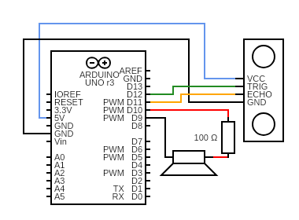
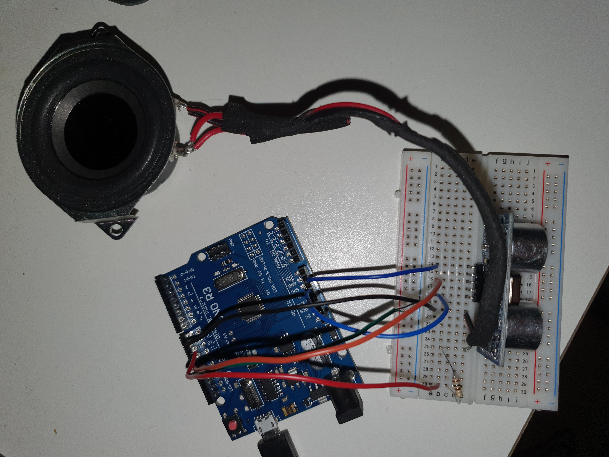

# Theremin

## What it does
This is an arduino UNO version of a theremin.
A theremin is an instrument played with your hands or any other object by moving it further or closer to a sensor.
Moving closer to the sensor results in a higher pitch and moving away from it creates a lower pitch.
Therefore you can create different notes and play music in floating air.

## How it works
#### Equipment
* Arduino UNO
* HY-SRF05 (compatible with HC-SR04)
* Speaker
* Breadboard
* Jumper wires
* 100 OHM resistor

My version uses an ultrasonic distance sensor to determine if an object is in front of the sensor and correlates to a frequency. To start the program I downloaded the libraries *NewPing* and *ToneAC* in order to avoid having to "reinvent the wheel" so to speak. These libraries contain code to easier navigate and manipulate the ultrasonic sensor and the frequencies for the speaker. Before going more in depth about the system, this is how the parts are connected together:


First I installed the libraries which is easier said than done but after a good amount of good old googling I found the creators installation manual [How to install](https://platformio.org/lib/search?query=owner:teckel12). Once the libraries were installed i had to define some variables for the code to be based on:
```#define TONE_PIN      9
#define TONE_VOLUME   1
#define TRIGGER_PIN   12   
#define ECHO_PIN      11   
```#define MAX_DISTANCE  200  